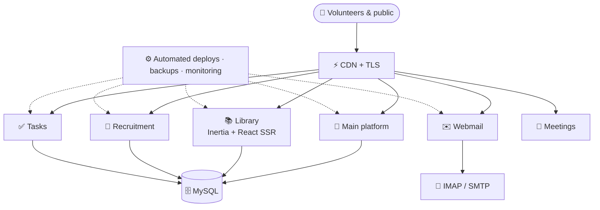
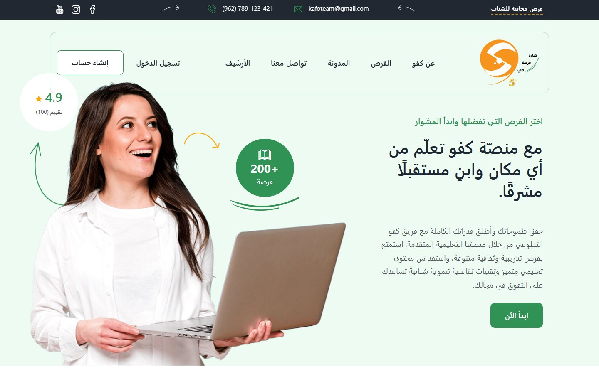
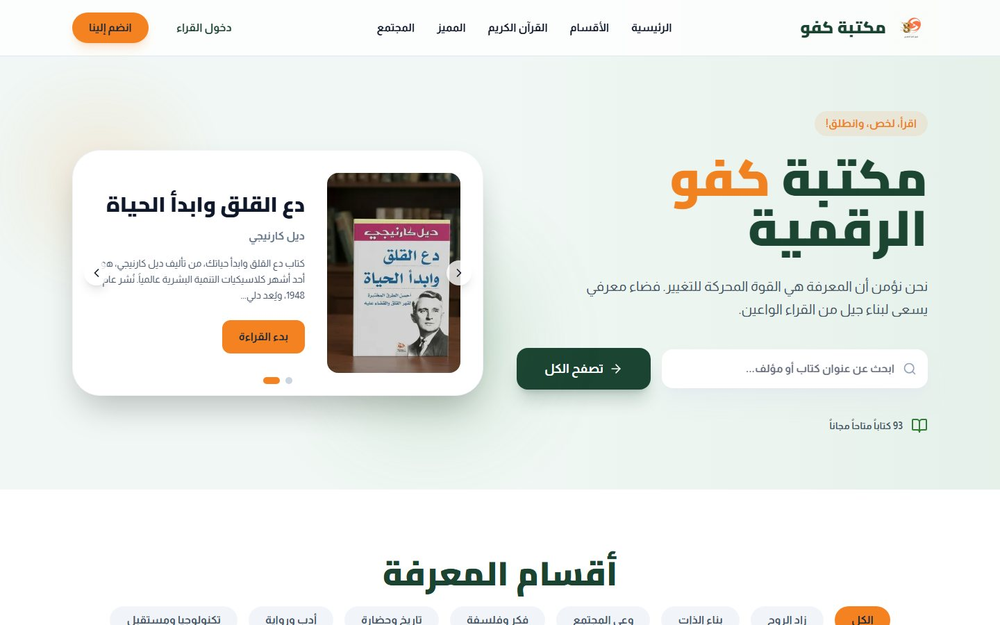
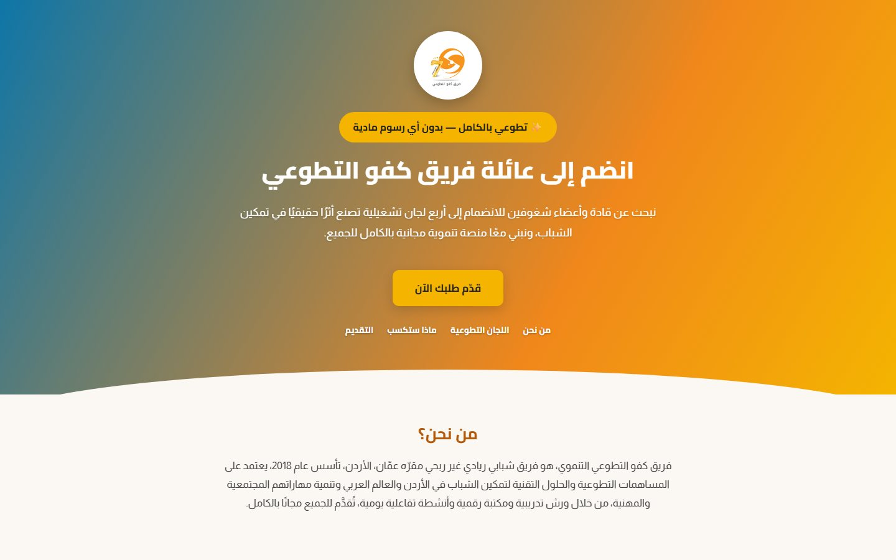

 

> 🔒 **The source code is private** (production / client work). This repository is a case study: what the product does, how it is built, and my role. A code walkthrough is available on request: [abdelqader.pro](https://abdelqader.pro) · [LinkedIn](https://www.linkedin.com/in/abdelqader-al-omari/).

## Overview
Kafo is a non-profit youth team in Amman (founded 2018) offering free training, dialogue sessions and volunteering across
Jordan and the Arab world. I designed and built its whole digital ecosystem: every product below runs in production.

| Product | What it does |
|---|---|
| 🌱 **Main platform** ([kafo.team](https://kafo.team)) | Opportunities directory, blog, archive, member accounts |
| 📚 **Digital library** ([library.kafo.team](https://library.kafo.team)) | Free books by category, reading, community summaries; Laravel 12 + Inertia + React with **SSR** for speed and SEO |
| 🤝 **Recruitment** ([join.kafo.team](https://join.kafo.team)) | Applications for the four volunteer committees |
| 🎥 **Meetings** | Secure self-hosted video meetings for the team |
| ✅ **Tasks** | Task & committee management |
| ✉️ **Mail · Drive** | Webmail on real IMAP/SMTP (Laravel + Livewire) and file storage |

## Architecture

## Highlights
- **RTL-first** Arabic interfaces with careful typography, responsive on every screen
- The library is **server-side rendered** (Inertia SSR) so pages are fast and indexable
- All products deploy automatically from private repositories, with encrypted backups and monitoring

## My role
Product design and full-stack development of every product, plus the infrastructure they run on.

## Tech
     

## Screenshots

 kafo.team: opportunities, blog and member accounts

 Digital library: browse, read and summarize books (server-side rendered)

 Recruitment site for the team&#x27;s four committees

---

**Built by [Abdelqader Al-Omari](https://github.com/abdelqader-alomari)** · Senior Full-Stack Engineer · AI & Enterprise Solutions

  

